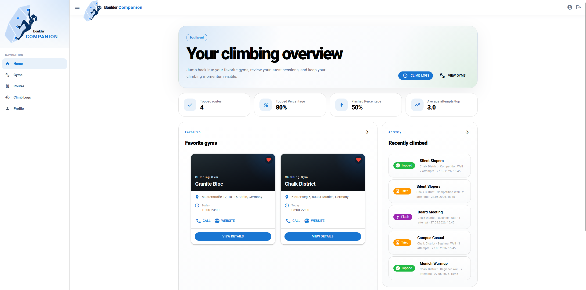
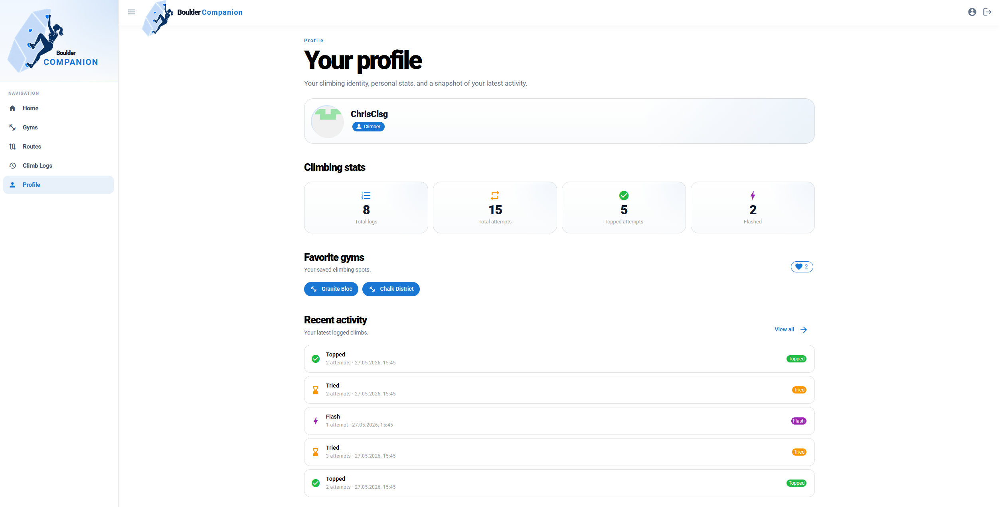
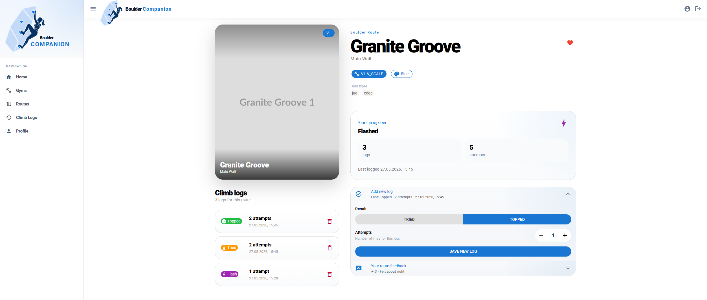

# Boulder Companion

A full-stack web app for managing indoor bouldering gym data, tracking climbing routes, and logging personal ascents. Built as a capstone project after completing a java development bootcamp.



## Features

**For climbers**
- Browse gyms and their route offerings
- Filter routes by difficulty, hold color, and wall
- Log ascents with attempt count, topped/flashed status, and date
- Rate routes and give difficulty feedback
- Favorite gyms and routes for quick access
- Personal stats dashboard: top rate, flash %, average attempts per top

**For gym admins & route setters** _(not yet implemented — see [Planned](#planned--in-progress))_
- Role-based access control (`CLIMBER`, `GYM_ADMIN`, `ROUTE_SETTER`)
- Gym admins manage gym data and assign route setters
- Route setters create and manage routes for their gym

---

## Tech Stack

| Layer | Technology |
|---|---|
| Frontend | Vue 3.5 · Quasar 2 · Pinia · TypeScript |
| Backend | Spring Boot 4 · Spring Security · Spring Data MongoDB |
| Database | MongoDB |
| Auth | GitHub OAuth2 · CSRF (HTTP-only cookie + XOR token) |
| Dev environment | Docker Compose (hot-reload for both services) |

---

## Architecture

```
frontend/   Vue 3 SPA (Quasar)
│   boot/axios.ts       Axios instance with automatic XSRF injection
│   stores/             Pinia stores per resource
│   api/                Thin Axios wrappers
│   pages/              One file per route
│   components/         Reusable UI (CardGrid, GymCard, …)
│   types/index.ts      Shared TypeScript types mirroring backend models

backend/    Spring Boot REST API
│   controller/         REST endpoints (Gym, Route, ClimbLog, User, Stats)
│   service/            Business logic
│   model/              Java records (Gym, Route, User, ClimbLog, RouteFeedback)
│   repository/         Spring Data MongoDB interfaces
│   security/           OAuth2 config, CORS, CSRF, role-based access
│   dto/                Request/response shapes separate from models
```

Authentication flow: the frontend redirects to `/api/oauth2/authorization/github` → Spring handles the GitHub callback → sets an XSRF cookie → Axios reads and forwards the token on every subsequent request.

---

## Getting Started

### Prerequisites

- [Docker](https://www.docker.com/) and Docker Compose
- A [GitHub OAuth app](https://github.com/settings/developers) with the callback URL set to:
  - Local: `http://localhost:8080/login/oauth2/code/github`
  - Production: `https://yourdomain.com/login/oauth2/code/github`

MongoDB is **bundled** — Docker Compose starts a MongoDB 8 container and persists data in a named `mongo-data` volume. No external database is needed unless you want to use Atlas or your own instance (override `BOULDER_COMPANION_MONGODB_URI` in `.env`).

On first start (empty volume) the seed script `docker/mongo-init.js` runs automatically and loads **5 fictional gyms** (Berlin, Munich, Hamburg, Cologne, Stuttgart) with **50 routes** (V0–V8) so the app is immediately browsable without any manual data entry.

### Setup

1. **Clone the repo**
   ```bash
   git clone https://github.com/ChrisClsg/boulder-companion.git
   cd boulder-companion
   ```

2. **Configure environment variables**
   ```bash
   cp .env.example .env
   # Fill in your GitHub OAuth credentials — MongoDB URI already points to the bundled container
   ```

3. **Start the dev stack**
   ```bash
   docker compose up
   ```

   The frontend runs at `http://localhost:5173`, the backend at `http://localhost:8080`.

   Database data is stored in the `mongo-data` Docker volume and survives container restarts. To wipe it and re-run the seed: `docker compose down -v && docker compose up`.

### Useful commands

```bash
# Frontend
docker compose run --rm frontend npm run lint
docker compose run --rm frontend npm test

# Backend
docker compose run --rm backend mvn test
docker compose run --rm backend mvn clean package
```

---

## Planned / in progress

- Frontend tests
- Gym admin & route setter functionality. The three roles (`CLIMBER`, `GYM_ADMIN`, `ROUTE_SETTER`) exist on the `User` model and are wired into Spring Security, but **no REST endpoints or frontend views** for admin/setter actions have been built yet. Everything a logged-in user can do today is as a `CLIMBER`.
- Stats for GymAdmins and RouteSetters
- Advanced user stats
- Offline Sync

---

## Screenshots

<p>
  
  
</p>

---

## License

All rights reserved. This project is publicly visible for portfolio purposes but is not open-source licensed.
